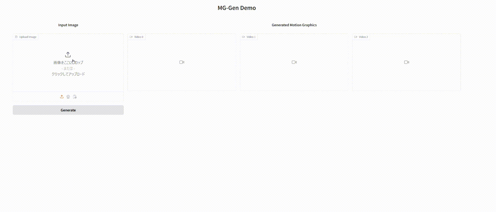

# MG-Gen: Single Image to Motion Graphics Generation with Layer Decopmosition
This is an official repository for MG-Gen.  
MG-Gen is a novel method to generate motion graphics from a single raster image preserving input content consistency with dynamic text motion.

- Paper: https://arxiv.org/abs/2504.02361
- Project Page: https://cyberagentailab.github.io/mggen/

# Setup Experimental Environment
Create and activate a Python venv. (Requirements: python >= 3.10)
```
python -m venv .venv
source .venv/bin/activate
```

Install dependencies.
```
pip install -r requirements.txt
playwright install
```

Download anime.min.js
```
mkdir src/libs/
curl -o src/libs/anime.min.js https://raw.githubusercontent.com/juliangarnier/anime/3.2.0/lib/anime.min.js
```

Download the weights from GCS.
If you have not installed gsutil, see the [installation instructions](https://cloud.google.com/storage/docs/gsutil_install?hl=en).
```
gsutil -m cp gs://ailab-public/image-to-video/mggen/weights.zip .
unzip weights.zip
```

# Generate motion graphics from images
Set your Gemini API_KEY in `.env`. You can get an API key for free from [Google AI Studio](https://aistudio.google.com/apikey). (20250331)
```
echo "GEMINI_APIKEY=\"your-api-key\"" > .env
```

Start a gradio demo sever.
```
cd src
python demo.py
```

Run a generation batch script.
```
cd src
python inference_batch.py --testset_dir "../example_inputs" 
```

Demo videos


# License
This project is licensed under the [GNU Affero General Public License v3.0 (AGPL-3.0)](https://www.gnu.org/licenses/agpl-3.0.en.html).

# Citation
```bibtex
@article{shirakawa2025mg,
  title={MG-Gen: Single Image to Motion Graphics Generation with Layer Decomposition},
  author={Shirakawa, Takahiro and Suzuki, Tomoyuki and Haraguchi, Daichi},
  journal={arXiv preprint arXiv:2504.02361},
  year={2025}
}
```
